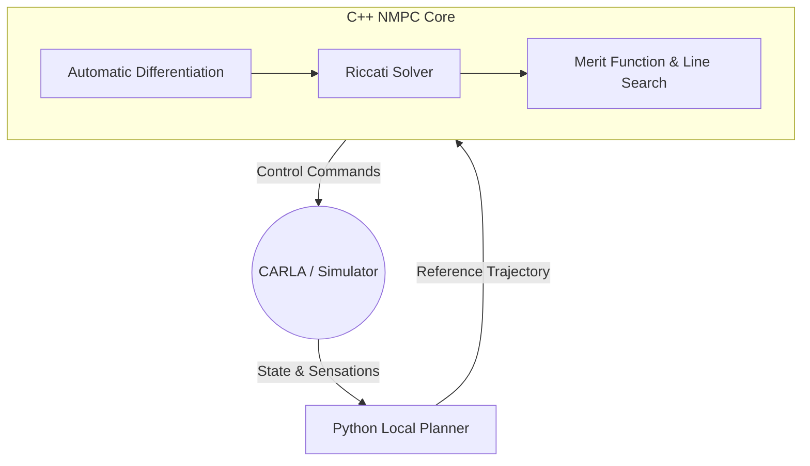
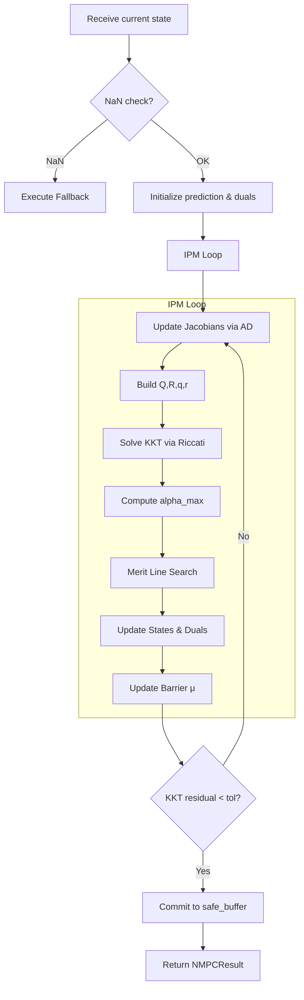

# SparseNMPC_IPM

!!! abstract "Overview"
    The `SparseNMPC_IPM.hpp` file implements a **Sparse Non-Linear Model Predictive Control (NMPC)** solver based on a **Primal-Dual Interior-Point Method (IPM)**.
    The solver is written as a header-only C++ class template, allowing it to be instantiated for different horizon lengths, plant models, and state/input dimensions.

## :material-lightbulb-on: Key Ideas

<div class="grid cards" markdown>

- :material-chart-scatter-plot-hexbin:
    **Sparse Formulation**
    
    The NMPC problem is solved in a sparse form. Dynamics are linearized only once per iteration (via AD), and a Riccati Recursion is used to solve the KKT system.

- :material-wall:
    **Barrier Constraints**
    
    Constraints (state limits, input limits, obstacle avoidance) are handled in a log-barrier fashion. Dual variables are updated in a "predict-correct" scheme.

- :material-scale-balance:
    **Merit Line-Search**
    
    A **merit function** is evaluated to drive a backtracking line-search and decide whether to accept a step or fall back to a safe control.

</div>

## :material-sitemap: System Architecture



## :material-folder-multiple: Includes & Namespaces

=== "Dependencies"

    ```cpp
    #include "Optimization/Control/SafeBuffer.hpp"
    #include "Optimization/Matrix/AD/DualVec.hpp"
    #include "Optimization/Matrix/Core/MathTraits.hpp"
    #include "Optimization/Matrix/Core/StaticMatrix.hpp"
    #include "Optimization/Simulation/Integrator.hpp"
    #include "Optimization/Solver/KKTMonitor.hpp"
    #include "Optimization/Solver/MeritLineSearch.hpp"
    #include "Optimization/Solver/RiccatiSolver.hpp"
    #include "Optimization/Dynamics/RealTimeDynamicsModel.hpp"
    ```

=== "Descriptions"

    - `SafeBuffer.hpp`: Keeps a recent safe trajectory for fallback if the IPM diverges.
    - `DualVec.hpp`: Automatic-differentiation (AD) variable used to compute Jacobians.
    - `MathTraits.hpp`: Math utilities (`max`, `min`, `isnan`, etc.).
    - `StaticMatrix.hpp`: Compile-time sized matrices/vectors (used for Riccati Solver).
    - `Integrator.hpp`: RK4 integration for the plant model.
    - `KKTMonitor.hpp`: Computes infinity-norm of the KKT residual.
    - `RiccatiSolver.hpp`: Solves the KKT linear system via Riccati recursion.
    - `RealTimeDynamicsModel.hpp`: Default plant model (e.g., bicycle model).

*The main class is located inside `namespace Optimization::controller`.*

## :material-database: Helper Data Structures

### ObstacleFrenet
Holds a Frenet-like description of an obstacle. The solver assumes at most 10 obstacles.
```cpp
struct ObstacleFrenet {
    double s = 0.0;  // Longitudinal Position
    double d = 0.0;  // Lateral Offset
    double r = 0.5;  // Radius
    double vs = 0.0; // Longitudinal Velocity
    double vd = 0.0; // Lateral Velocity
};
```

### NMPCResult
Returned by `solve_ipm()`. Stores convergence information and fallback status.
```cpp
struct NMPCResult {
    bool success = false;
    bool fallback_triggered = false;
    double max_kkt_error = 0.0;
    int sqp_iterations = 0;
    std::string status_msg = "OK";
};
```

### NMPCTuningConfig
Contains all tunable weights and constraints.

| Field | Meaning |
| :--- | :--- |
| `Q_D`, `Q_mu`, `Q_Vx`, `Q_Vy`, `Q_r`, `Q_alpha_f`, `Q_alpha_r` | State weighting terms |
| `R_Steer`, `R_Accel` | Input weighting terms |
| `Obstacle_Margin` | Safety margin added to obstacle radius |
| `damping_Q`, `damping_R` | Regularization added to Hessian |
| `d_max`, `d_min` | Lateral limits |
| `u_min`, `u_max` | Input limits |
| `kappa` | Road curvature (affects dynamics) |
| `target_vx` | Target longitudinal speed |
| `target_d[100]` | Desired lateral offset over horizon (first `H` values used) |
| `ipm_max_iter` | Max IPM iterations (default 8) |
| `kkt_tolerance` | Convergence tolerance (default 1e-2) |

## :material-memory: Class Template: `SparseNMPC_IPM`

```cpp
template <size_t H, typename PlantModel = Dynamics::RealTimeDynamicsModel, size_t Nx = 8, size_t Nu = 2>
class SparseNMPC_IPM {};
```
Parameterized by Horizon `H`, state dimension `Nx`, and input dimension `Nu`.

=== "Internal Types"
    ```cpp
    struct ConstraintState {
        double s = 1.0;    // Slack Variable
        double lam = 1.0;  // Dual Variable
        double ds = 0.0;   // Change of Slack
        double dlam = 0.0; // Change of Dual
    };
    
    struct IPMDuals {
        ConstraintState d_max, d_min;
        ConstraintState u_max[2], u_min[2];
        ConstraintState obs[10];
    };
    ```

=== "Member Variables"
    All containers are `std::array` with compile-time sizes, keeping the memory footprint small and cache-friendly.
    
    | Variable | Purpose |
    | :--- | :--- |
    | `dt` | Time step between prediction steps (0.05s). |
    | `U_guess[H]` | Current control trajectory guess. |
    | `X_pred[H+1]` | Predicted state trajectory. |
    | `duals[H]` | Dual variables for every time step. |
    | `obstacles[10]` | List of obstacles. |
    | `mu` | Barrier parameter ($\mu$). |
    | `riccati` | Instance of `RiccatiSolver`. |
    | `safe_buffer` | Stores a safe trajectory for fallback. |

## :material-cog-sync: How the Solver Works



### Core Methods

1. `shift_sequence()`: Slides all trajectories one step forward, halves the last control command, and predicts the next terminal state via RK4.
2. `execute_fallback()`: Triggered when the IPM fails (NaN, divergence). Reverts to a known safe trajectory stored in `safe_buffer`.
3. `evaluate_merit()`: Computes the scalar merit function balancing state deviation, tracking cost, log-barrier penalties, and dynamics consistency.
4. `solve_ipm()`: The main SQP/IPM loop executing the algorithm described in the flowchart above.

!!! tip "Important Implementation Details"
    - **Barrier update**: Dual updates use `cs.dlam = (mu - cs.lam * cs.s - cs.lam * cs.ds) / cs.s;` (derived from the derivative of $\lambda = \mu / s$).
    - **Jacobian Caching**: Constraint Jacobians are computed via AD only every other iteration to save computational time.
    - **Regularization**: `damping_Q` and `damping_R` are added to the Hessian to maintain it as Symmetric Positive Definite (SPD).

## :material-chart-line: Performance Notes

!!! success "Engineering Considerations"
    - **Static sizing**: All matrices/vectors use compile-time sizes (`StaticMatrix`), eliminating dynamic allocation and improving cache locality.
    - **Riccati Recursion**: Solves the KKT system in $\mathcal{O}(H \times \max(N_x, N_u)^2)$ operations, which is optimal for sparse MPC.
    - **AD Jacobian update**: Updating every other step reduces expensive AD evaluations by 50%.
    - **Merit function overhead**: Evaluated repeatedly during line-search, adding overhead but ensuring robust convergence and safety.

This code is well-structured and suitable for real-time control on embedded platforms at 20Hz. For very long horizons or higher-dimensional models, further parallelization of Jacobian computations or exploiting sparsity in constraint Jacobians could be considered.