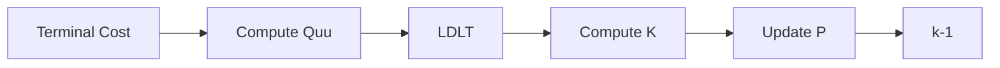

# Riccati Solver

!!! abstract "Overview"
    This solver implements a **discrete-time Riccati recursion** for solving the quadratic subproblem generated during each Interior Point Method (IPM) iteration of the NMPC controller.
    
    The implementation is designed for **hard real-time execution** and performs **zero dynamic memory allocation**.

## :material-function: Problem Formulation

!!! math "Optimal Control Problem"
    $$
    \begin{aligned}
    \min_{\{u_k\},\{x_{k+1}\}}
    \quad&
    \frac12
    \sum_{k=0}^{H-1}
    \left(
    x_k^TQ_kx_k
    +
    q_k^Tx_k
    +
    u_k^TR_ku_k
    +
    r_k^Tu_k
    \right)
    \\
    &
    +
    \frac12x_H^TQ_Hx_H
    +
    q_H^Tx_H
    \\[1ex]
    \text{s.t.}\quad&
    x_{k+1}
    =
    A_kx_k
    +
    B_ku_k
    +
    d_k
    \end{aligned}
    $$

| Variable | Description | Mathematical Meaning |
| -------- | ----------- | -------------------- |
| `A`,`B`,`d` | Linearized dynamics | $x_{k+1}=A_kx_k+B_ku_k+d_k$ |
| `Q`,`R`,`q`,`r` | Stage cost | Running cost matrices |
| `P`,`p` | Value function | $V_k(x)$ |
| `K`,`k_ff` | Control policy | $\Delta u_k = K_k\Delta x_k+k_{ff, k}$ |
| `dx`, `du`| State and input updates | $\Delta x_k$, $\Delta u_k$ |

## :material-star: Implementation Characteristics

!!! success "Implementation Characteristics"
    - Zero dynamic memory allocation
    - Static memory layout (`std::array`)
    - Compile-time dimensions
    - LDLT factorization
    - Explicit symmetry enforcement
    - Designed for deterministic execution

## :material-memory: Data Structures

All containers are `std::array` of `matrix::StaticMatrix/StaticVector`, meaning **no dynamic allocation** and the size is known at compile time.
The solver is parameterized by the horizon `H`, state dimension `Nx`, and input dimension `Nu`.

=== "Dynamics"

    ```cpp
    std::array<matrix::StaticMatrix<double, Nx, Nx>, H> A;
    std::array<matrix::StaticMatrix<double, Nx, Nu>, H> B;
    std::array<matrix::StaticVector<double, Nx>, H> d;
    ```
    
    Linearized dynamics at every step. Filled by the IPM before calling `riccati.solve()`.

=== "Cost"

    ```cpp
    std::array<matrix::StaticMatrix<double, Nx, Nx>, H + 1> Q;
    std::array<matrix::StaticMatrix<double, Nu, Nu>, H> R;
    std::array<matrix::StaticVector<double, Nx>, H + 1> q;
    std::array<matrix::StaticVector<double, Nu>, H> r;
    ```
    
    Stage cost. Terminal cost is stored in `Q[H]`, `q[H]`.

=== "Value Function"

    ```cpp
    std::array<matrix::StaticMatrix<double, Nx, Nx>, H + 1> P;
    std::array<matrix::StaticVector<double, Nx>, H + 1> p;
    ```
    
    Value-function parameters $V_k(x) = \frac{1}{2}x^T P_k x + p_k^T x$. Computed in the **backward pass**.

=== "Policy"

    ```cpp
    std::array<matrix::StaticMatrix<double, Nu, Nx>, H> K;
    std::array<matrix::StaticVector<double, Nu>, H> k_ff;
    ```
    
    Feedback gain and feed-forward term. Policy is $\Delta u_k = K_k \Delta x_k + k_{ff, k}$.

=== "Forward Pass"

    ```cpp
    std::array<matrix::StaticVector<double, Nx>, H + 1> dx;
    std::array<matrix::StaticVector<double, Nu>, H> du;
    ```
    
    State and input updates produced in the **forward pass**.

## :material-cog-sync: Algorithm

### Backward Pass



The backward pass follows the classic discrete-time Riccati recursion for a linear-quadratic problem, written **without dynamic memory allocation**.

| Step | Mathematical expression | Code Snippet |
| :--- | :--- | :--- |
| 1. Intermediate products | $P_{k+1}A_{k}, \\ P_{k+1}B_{k}$ | `P_next_A = P[k+1] * A[k];` <br> `P_next_B = P[k+1] * B[k]` |
| 2. `Quu` & `Qux` | $Q_{uu} = R_{k}+B_{k}^{T}P_{k+1}B_{k} \\ Q_{ux} = B_{k}^{T}P_{k+1}A_{k}$ | `Quu = R[k] + B^T * P_next_B;` <br> `Qux = B^T * P_next_A;` |
| 3. Affine parts | $p_{next, t} = p_{k+1} + P_{k+1}d_{k} \\ q_{k} = r_{k}+B_{k}^{T}p_{next, d}$ | `p_next_d = p[k+1] + P[k+1] * d[k];` <br> `q_u = r[k] + B^T * p_next_d;` |
| 4. Regularization | $Q_{uu} \leftarrow Q_{uu} + reg_{u}I$ | `for (i) Quu(i, i) += reg_u;` |
| 5. Solve | Solve $Q_{uu}^{-1}$ via LDLT | `linalg::LDLT_decompose(Quu);` <br> `linalg::LDLT_solve(Quu, ...);` |
| 6. Policy | $K_{k} = -Q_{uu}^{-1}Q_{ux} \\ k_{ff, k} = -Q_{uu}^{-1} q_{u}$ | Column-wise solve for `K[k];` <br> solve once for `k_ff[k]` |
| 7. Value-function update | $P_{k} = Q_{k} + A_{k}^{T}P_{k+1}A_{k} + K_{k}^{T} Q_{ux} \\ p_{k} = q_{k} + A_{k}^{T}p_{next,d} + Q_{ux}^{T}k_{ff, k}$ | Compute `AT_PA`, `KT_Qux`, `AT_Pnd`, `QuxT_kff` |

!!! warning
    `Quu` must remain positive definite. If LDLT decomposition fails, the solver immediately returns `SolverStatus::MATH_ERROR`.

### Forward Pass

No regularization is needed because the policy has already been stabilized during the backward pass. The forward pass produces the actual state and input perturbations that will be applied to the nominal trajectory.

## :material-laptop: Code Walk-through

```cpp
P[H] = Q[H];            // (1)
p[H] = q[H];
for (int i = 0; i < Nx; ++i) { // (2)
    P[H](i, i) += reg_x;
}

// ... Backward pass loop over k ...

dx[0].setZero();        // (3)
for (int k = 0; k < H; ++k) {
    du[k] = K[k] * dx[k] + k_ff[k]; // (4)
    dx[k+1] = A[k] * dx[k] + B[k] * du[k] + d[k];
}
```

1. Terminal value function initialization using the terminal cost.
2. Optional diagonal state regularization (`reg_x`) is added to the Hessian to keep it positive-definite.
3. The forward pass starts from zero perturbation at the initial state.
4. Optimal policy applies the feedback gain and feed-forward term.

## :material-chart-line: Performance Notes

!!! tip "Engineering Considerations"
    - **No dynamic memory allocation:** All arrays use stack memory (`std::array`) preventing heap fragmentation and unpredictable latency.
    - **Compile-time dimensions (`H`, `Nx`, `Nu`):** Allows the compiler to aggressively unroll loops and optimize the Riccati recursion for the specific problem scale.
    - **Cache-friendly layout:** Data structures are contiguous in memory.
    - **LDLT factorization:** A computationally robust method for symmetric positive-definite matrices that scales well.
    - **Explicit symmetry enforcement:** Regularization (`reg_x`) is added to the diagonal of `P_k` after each update, and symmetry of `P_k` is enforced explicitly to counteract round-off errors. This explicit symmetry enforcement is crucial for deterministic execution and mitigating numerical drift in hard real-time systems.

## :material-api: Usage inside SparseNMPC_IPM

In `SparseNMPC_IPM::solve_ipm()`, the Riccati solver is invoked after the Jacobian and cost parameters (`A, B, d, Q, R, q, r`) have been constructed for the current IPM iteration.

```cpp
if (riccati.solve() != SolverStatus::SUCCESS) { // (1)
    return execute_fallback(...);
}
```

1. Returns `SolverStatus::SUCCESS` if the backward pass finishes without a math error.

The solver provides `du[k]` (the Newton step for the control trajectory) and `dx[k]` (the corresponding state update). These vectors are used in the **IPM Loop** to:

- Update `U_guess` (controls) and `X_pred` (states).
- Update dual variables `duals[k]`.
- Compute the KKT residual (`du_vec`) for convergence checking.
