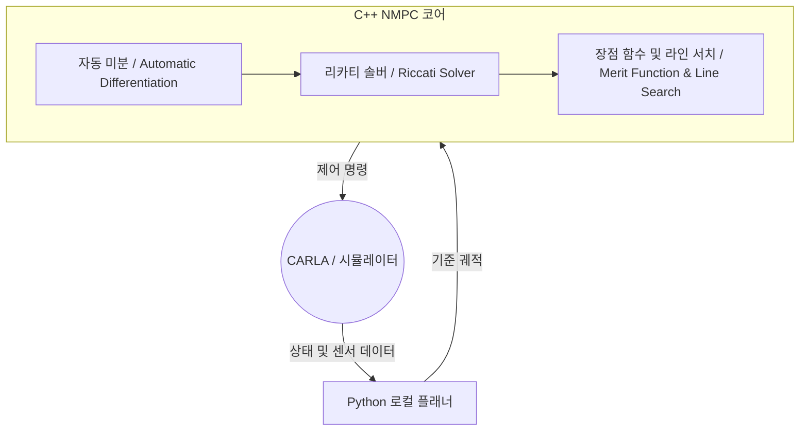
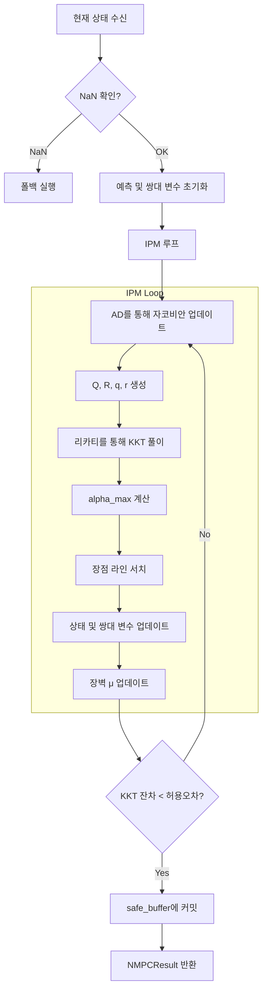

# SparseNMPC_IPM

!!! abstract "개요 (Overview)"
    `SparseNMPC_IPM.hpp` 파일은 **원시-쌍대 내점법(Primal-Dual Interior-Point Method, IPM)** 기반의 **희소 비선형 모델 예측 제어(Sparse Non-Linear Model Predictive Control, NMPC)** 솔버를 구현합니다.
    이 솔버는 헤더 전용(header-only) C++ 클래스 템플릿으로 작성되어, 다양한 예측 구간(horizon lengths), 플랜트 모델 및 상태/입력 차원에 대해 인스턴스화할 수 있습니다.

## :material-lightbulb-on: 핵심 아이디어 (Key Ideas)

<div class="grid cards" markdown>

- :material-chart-scatter-plot-hexbin:
    **희소 공식화 (Sparse Formulation)**
    
    NMPC 문제는 희소한(sparse) 형태로 풀립니다. 동역학은 반복(iteration)마다 한 번씩만 선형화되며(AD를 통해), KKT 시스템을 풀기 위해 리카티 재귀(Riccati Recursion)가 사용됩니다.

- :material-wall:
    **장벽 제약 (Barrier Constraints)**
    
    제약 조건(상태 한계, 입력 한계, 장애물 회피)은 로그 장벽(log-barrier) 방식으로 처리됩니다. 쌍대 변수(Dual variables)는 "예측-보정(predict-correct)" 기법으로 업데이트됩니다.

- :material-scale-balance:
    **장점 라인 서치 (Merit Line-Search)**
    
    **장점 함수(merit function)** 를 평가하여 백트래킹 라인 서치(backtracking line-search)를 유도하고 스텝을 수락할지 아니면 안전 제어로 폴백(fallback)할지 결정합니다.

</div>

## :material-sitemap: 시스템 아키텍처 (System Architecture)



## :material-folder-multiple: 포함 파일 및 네임스페이스 (Includes & Namespaces)

=== "의존성 (Dependencies)"

    ```cpp
    #include "Optimization/Control/SafeBuffer.hpp"
    #include "Optimization/Matrix/AD/DualVec.hpp"
    #include "Optimization/Matrix/Core/MathTraits.hpp"
    #include "Optimization/Matrix/Core/StaticMatrix.hpp"
    #include "Optimization/Simulation/Integrator.hpp"
    #include "Optimization/Solver/KKTMonitor.hpp"
    #include "Optimization/Solver/MeritLineSearch.hpp"
    #include "Optimization/Solver/RiccatiSolver.hpp"
    #include "Optimization/Dynamics/RealTimeDynamicsModel.hpp"
    ```

=== "설명 (Descriptions)"

    - `SafeBuffer.hpp`: IPM이 발산할 경우 폴백을 위한 최근의 안전한 궤적을 유지합니다.
    - `DualVec.hpp`: 자코비안을 계산하는 데 사용되는 자동 미분(AD) 변수입니다.
    - `MathTraits.hpp`: 수학 유틸리티 (`max`, `min`, `isnan` 등).
    - `StaticMatrix.hpp`: 컴파일 타임에 크기가 결정되는 행렬/벡터 (리카티 솔버에 사용됨).
    - `Integrator.hpp`: 플랜트 모델을 위한 RK4 적분기.
    - `KKTMonitor.hpp`: KKT 잔차의 무한대 노름(infinity-norm)을 계산합니다.
    - `RiccatiSolver.hpp`: 리카티 재귀를 통해 KKT 선형 시스템을 풉니다.
    - `RealTimeDynamicsModel.hpp`: 기본 플랜트 모델 (예: 자전거 모델).

*메인 클래스는 `namespace Optimization::controller` 내부에 위치합니다.*

## :material-database: 보조 데이터 구조 (Helper Data Structures)

### ObstacleFrenet
장애물의 Frenet 방식 설명을 유지합니다. 솔버는 최대 10개의 장애물을 가정합니다.
```cpp
struct ObstacleFrenet {
    double s = 0.0;  // 종방향 위치
    double d = 0.0;  // 횡방향 오프셋
    double r = 0.5;  // 반경
    double vs = 0.0; // 종방향 속도
    double vd = 0.0; // 횡방향 속도
};
```

### NMPCResult
`solve_ipm()`이 반환하는 구조체입니다. 수렴 정보와 폴백 상태를 저장합니다.
```cpp
struct NMPCResult {
    bool success = false;
    bool fallback_triggered = false;
    double max_kkt_error = 0.0;
    int sqp_iterations = 0;
    std::string status_msg = "OK";
};
```

### NMPCTuningConfig
모든 튜닝 가능한 가중치 및 제약 조건을 포함합니다.

| 필드 | 의미 |
| :--- | :--- |
| `Q_D`, `Q_mu`, `Q_Vx`, `Q_Vy`, `Q_r`, `Q_alpha_f`, `Q_alpha_r` | 상태 가중치 항 |
| `R_Steer`, `R_Accel` | 입력 가중치 항 |
| `Obstacle_Margin` | 장애물 반경에 추가되는 안전 여유(margin) |
| `damping_Q`, `damping_R` | 헤시안에 추가되는 정규화(Regularization) |
| `d_max`, `d_min` | 횡방향 한계 |
| `u_min`, `u_max` | 입력 한계 |
| `kappa` | 도로 곡률 (동역학에 영향) |
| `target_vx` | 목표 종방향 속도 |
| `target_d[100]` | 예측 구간에 걸친 원하는 횡방향 오프셋 (처음 `H`개의 값 사용됨) |
| `ipm_max_iter` | 최대 IPM 반복 횟수 (기본 8) |
| `kkt_tolerance` | 수렴 허용 오차 (기본 1e-2) |

## :material-memory: 클래스 템플릿: `SparseNMPC_IPM`

```cpp
template <size_t H, typename PlantModel = Dynamics::RealTimeDynamicsModel, size_t Nx = 8, size_t Nu = 2>
class SparseNMPC_IPM {};
```
예측 구간 `H`, 상태 차원 `Nx` 및 입력 차원 `Nu`에 의해 매개변수화됩니다.

=== "내부 타입 (Internal Types)"
    ```cpp
    struct ConstraintState {
        double s = 1.0;    // 여유 변수 (Slack Variable)
        double lam = 1.0;  // 쌍대 변수 (Dual Variable)
        double ds = 0.0;   // 여유 변수의 변화량
        double dlam = 0.0; // 쌍대 변수의 변화량
    };
    
    struct IPMDuals {
        ConstraintState d_max, d_min;
        ConstraintState u_max[2], u_min[2];
        ConstraintState obs[10];
    };
    ```

=== "멤버 변수 (Member Variables)"
    모든 컨테이너는 컴파일 타임 크기를 갖는 `std::array`이므로 메모리 풋프린트가 작고 캐시 친화적입니다.
    
    | 변수 | 목적 |
    | :--- | :--- |
    | `dt` | 예측 단계 간의 시간 스텝 (0.05s). |
    | `U_guess[H]` | 현재 제어 궤적 추측치. |
    | `X_pred[H+1]` | 예측된 상태 궤적. |
    | `duals[H]` | 모든 시간 스텝에 대한 쌍대 변수. |
    | `obstacles[10]` | 장애물 목록. |
    | `mu` | 장벽 매개변수 ($\mu$). |
    | `riccati` | `RiccatiSolver`의 인스턴스. |
    | `safe_buffer` | 폴백을 위한 안전한 궤적을 저장합니다. |

## :material-cog-sync: 솔버 작동 방식 (How the Solver Works)



### 핵심 메서드 (Core Methods)

1. `shift_sequence()`: 모든 궤적을 한 스텝 앞으로 밀고, 마지막 제어 명령을 절반으로 줄인 뒤 RK4를 통해 다음 종료 상태를 예측합니다.
2. `execute_fallback()`: IPM이 실패할 때(NaN, 발산) 트리거됩니다. `safe_buffer`에 저장된 알려진 안전한 궤적으로 되돌립니다.
3. `evaluate_merit()`: 상태 편차, 추적 비용, 로그 장벽 페널티 및 동역학적 일관성의 균형을 맞추는 스칼라 장점 함수를 계산합니다.
4. `solve_ipm()`: 위 흐름도에 설명된 알고리즘을 실행하는 기본 SQP/IPM 루프입니다.

!!! tip "중요한 구현 세부 사항 (Important Implementation Details)"
    - **장벽 업데이트 (Barrier update)**: 쌍대 업데이트는 `cs.dlam = (mu - cs.lam * cs.s - cs.lam * cs.ds) / cs.s;` 를 사용합니다 ($\lambda = \mu / s$의 미분에서 도출됨).
    - **자코비안 캐싱 (Jacobian Caching)**: 제약 조건 자코비안은 계산 시간을 절약하기 위해 한 번 걸러서(every other iteration) AD를 통해 계산됩니다.
    - **정규화 (Regularization)**: 헤시안을 대칭 양의 정부호(SPD, Symmetric Positive Definite)로 유지하기 위해 `damping_Q`와 `damping_R`이 헤시안에 추가됩니다.

## :material-chart-line: 성능 노트 (Performance Notes)

!!! success "엔지니어링 고려 사항 (Engineering Considerations)"
    - **정적 크기 조정 (Static sizing)**: 모든 행렬/벡터는 컴파일 타임 크기(`StaticMatrix`)를 사용하므로 동적 할당이 제거되고 캐시 지역성이 향상됩니다.
    - **리카티 재귀 (Riccati Recursion)**: 희소 MPC에 최적인 $\mathcal{O}(H \times \max(N_x, N_u)^2)$ 연산으로 KKT 시스템을 풉니다.
    - **AD 자코비안 업데이트 (AD Jacobian update)**: 한 번 걸러 업데이트하면 비용이 많이 드는 AD 평가를 50% 줄일 수 있습니다.
    - **장점 함수 오버헤드 (Merit function overhead)**: 라인 서치 중에 반복적으로 평가되어 오버헤드가 추가되지만 견고한 수렴과 안전성을 보장합니다.

이 코드는 잘 구조화되어 있으며 20Hz의 임베디드 플랫폼에서 실시간 제어에 적합합니다. 매우 긴 예측 구간이나 고차원 모델의 경우, 자코비안 계산의 추가적인 병렬화나 제약 조건 자코비안의 희소성을 활용하는 것을 고려할 수 있습니다.