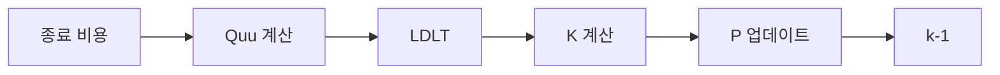

# 리카티 솔버 (Riccati Solver)

!!! abstract "개요 (Overview)"
    이 솔버는 NMPC 제어기의 내점법(IPM) 반복(iteration)마다 생성되는 이차 하위 문제(quadratic subproblem)를 해결하기 위한 **이산 시간 리카티 재귀(discrete-time Riccati recursion)** 를 구현합니다.
    
    이 구현은 **하드 리얼타임(hard real-time) 실행**을 위해 설계되었으며 **동적 메모리 할당을 전혀 수행하지 않습니다(zero dynamic memory allocation)**.

## :material-function: 문제 공식화 (Problem Formulation)

!!! math "최적 제어 문제 (Optimal Control Problem)"
    $$
    \begin{aligned}
    \min_{\{u_k\},\{x_{k+1}\}}
    \quad&
    \frac12
    \sum_{k=0}^{H-1}
    \left(
    x_k^TQ_kx_k
    +
    q_k^Tx_k
    +
    u_k^TR_ku_k
    +
    r_k^Tu_k
    \right)
    \\
    &
    +
    \frac12x_H^TQ_Hx_H
    +
    q_H^Tx_H
    \\[1ex]
    \text{s.t.}\quad&
    x_{k+1}
    =
    A_kx_k
    +
    B_ku_k
    +
    d_k
    \end{aligned}
    $$

| 변수 | 설명 | 수학적 의미 |
| -------- | ----------- | -------------------- |
| `A`,`B`,`d` | 선형화된 동역학 (Linearized dynamics) | $x_{k+1}=A_kx_k+B_ku_k+d_k$ |
| `Q`,`R`,`q`,`r` | 단계 비용 (Stage cost) | 진행 비용 행렬 (Running cost matrices) |
| `P`,`p` | 가치 함수 (Value function) | $V_k(x)$ |
| `K`,`k_ff` | 제어 정책 (Control policy) | $\Delta u_k = K_k\Delta x_k+k_{ff, k}$ |
| `dx`, `du`| 상태 및 입력 업데이트 (State and input updates) | $\Delta x_k$, $\Delta u_k$ |

## :material-star: 구현 특성 (Implementation Characteristics)

!!! success "구현 특성 (Implementation Characteristics)"
    - 동적 메모리 할당 제로 (Zero dynamic memory allocation)
    - 정적 메모리 레이아웃 (`std::array`)
    - 컴파일 타임 차원 결정 (Compile-time dimensions)
    - LDLT 인수분해 (LDLT factorization)
    - 명시적인 대칭성 강제 (Explicit symmetry enforcement)
    - 결정론적 실행을 위한 설계 (Designed for deterministic execution)

## :material-memory: 데이터 구조 (Data Structures)

모든 컨테이너는 `matrix::StaticMatrix/StaticVector`의 `std::array`이므로, **동적 할당이 없고** 크기는 컴파일 타임에 알려져 있습니다.
솔버는 예측 구간 `H`, 상태 차원 `Nx`, 입력 차원 `Nu`로 매개변수화됩니다.

=== "동역학 (Dynamics)"

    ```cpp
    std::array<matrix::StaticMatrix<double, Nx, Nx>, H> A;
    std::array<matrix::StaticMatrix<double, Nx, Nu>, H> B;
    std::array<matrix::StaticVector<double, Nx>, H> d;
    ```
    
    모든 단계에서의 선형화된 동역학입니다. `riccati.solve()`를 호출하기 전에 IPM에 의해 채워집니다.

=== "비용 (Cost)"

    ```cpp
    std::array<matrix::StaticMatrix<double, Nx, Nx>, H + 1> Q;
    std::array<matrix::StaticMatrix<double, Nu, Nu>, H> R;
    std::array<matrix::StaticVector<double, Nx>, H + 1> q;
    std::array<matrix::StaticVector<double, Nu>, H> r;
    ```
    
    단계 비용입니다. 종료 비용(Terminal cost)은 `Q[H]`, `q[H]`에 저장됩니다.

=== "가치 함수 (Value Function)"

    ```cpp
    std::array<matrix::StaticMatrix<double, Nx, Nx>, H + 1> P;
    std::array<matrix::StaticVector<double, Nx>, H + 1> p;
    ```
    
    가치 함수 매개변수 $V_k(x) = \frac{1}{2}x^T P_k x + p_k^T x$입니다. **후방 패스(backward pass)** 에서 계산됩니다.

=== "정책 (Policy)"

    ```cpp
    std::array<matrix::StaticMatrix<double, Nu, Nx>, H> K;
    std::array<matrix::StaticVector<double, Nu>, H> k_ff;
    ```
    
    피드백 게인(Feedback gain) 및 피드포워드(feed-forward) 항입니다. 정책은 $\Delta u_k = K_k \Delta x_k + k_{ff, k}$입니다.

=== "전방 패스 (Forward Pass)"

    ```cpp
    std::array<matrix::StaticVector<double, Nx>, H + 1> dx;
    std::array<matrix::StaticVector<double, Nu>, H> du;
    ```
    
    **전방 패스(forward pass)** 에서 생성되는 상태 및 입력 업데이트입니다.

## :material-cog-sync: 알고리즘 (Algorithm)

### 후방 패스 (Backward Pass)



후방 패스는 선형 이차 문제(linear-quadratic problem)에 대한 고전적인 이산 시간 리카티 재귀를 따르며, **동적 메모리 할당 없이** 작성되었습니다.

| 단계 | 수학식 (Mathematical expression) | 코드 스니펫 (Code Snippet) |
| :--- | :--- | :--- |
| 1. 중간 산물 | $P_{k+1}A_{k}, \\ P_{k+1}B_{k}$ | `P_next_A = P[k+1] * A[k];` <br> `P_next_B = P[k+1] * B[k]` |
| 2. `Quu` & `Qux` | $Q_{uu} = R_{k}+B_{k}^{T}P_{k+1}B_{k} \\ Q_{ux} = B_{k}^{T}P_{k+1}A_{k}$ | `Quu = R[k] + B^T * P_next_B;` <br> `Qux = B^T * P_next_A;` |
| 3. 아핀(Affine) 부분 | $p_{next, t} = p_{k+1} + P_{k+1}d_{k} \\ q_{k} = r_{k}+B_{k}^{T}p_{next, d}$ | `p_next_d = p[k+1] + P[k+1] * d[k];` <br> `q_u = r[k] + B^T * p_next_d;` |
| 4. 정규화 (Regularization) | $Q_{uu} \leftarrow Q_{uu} + reg_{u}I$ | `for (i) Quu(i, i) += reg_u;` |
| 5. 풀이 (Solve) | LDLT를 통한 $Q_{uu}^{-1}$ 풀이 | `linalg::LDLT_decompose(Quu);` <br> `linalg::LDLT_solve(Quu, ...);` |
| 6. 정책 (Policy) | $K_{k} = -Q_{uu}^{-1}Q_{ux} \\ k_{ff, k} = -Q_{uu}^{-1} q_{u}$ | `K[k]`를 열(column) 단위로 풀이; <br> `k_ff[k]`를 한 번에 풀이 |
| 7. 가치 함수 업데이트 | $P_{k} = Q_{k} + A_{k}^{T}P_{k+1}A_{k} + K_{k}^{T} Q_{ux} \\ p_{k} = q_{k} + A_{k}^{T}p_{next,d} + Q_{ux}^{T}k_{ff, k}$ | `AT_PA`, `KT_Qux`, `AT_Pnd`, `QuxT_kff` 계산 |

!!! warning
    `Quu`는 양의 정부호(positive definite)를 유지해야 합니다. LDLT 인수분해가 실패하면 솔버는 즉시 `SolverStatus::MATH_ERROR`를 반환합니다.

### 전방 패스 (Forward Pass)

후방 패스 중에 정책이 이미 안정화되었으므로 정규화가 필요하지 않습니다. 전방 패스는 공칭 궤적(nominal trajectory)에 적용될 실제 상태 및 입력 섭동(perturbations)을 생성합니다.

## :material-laptop: 코드 살펴보기 (Code Walk-through)

```cpp
P[H] = Q[H];            // (1)
p[H] = q[H];
for (int i = 0; i < Nx; ++i) { // (2)
    P[H](i, i) += reg_x;
}

// ... k에 대한 후방 패스 루프 ...

dx[0].setZero();        // (3)
for (int k = 0; k < H; ++k) {
    du[k] = K[k] * dx[k] + k_ff[k]; // (4)
    dx[k+1] = A[k] * dx[k] + B[k] * du[k] + d[k];
}
```

1. 종료 비용을 사용하여 종료 가치 함수를 초기화합니다.
2. 헤시안을 양의 정부호로 유지하기 위해 선택적인 대각 상태 정규화(`reg_x`)가 추가됩니다.
3. 전방 패스는 초기 상태의 0 섭동에서 시작합니다.
4. 최적 정책은 피드백 게인과 피드포워드 항을 적용합니다.

## :material-chart-line: 성능 노트 (Performance Notes)

!!! tip "엔지니어링 고려 사항 (Engineering Considerations)"
    - **동적 메모리 할당 없음:** 모든 배열은 스택 메모리(`std::array`)를 사용하여 힙 단편화와 예측할 수 없는 지연 시간을 방지합니다.
    - **컴파일 타임 차원 결정 (`H`, `Nx`, `Nu`):** 컴파일러가 특정 문제 규모에 대해 루프를 공격적으로 전개(unroll)하고 리카티 재귀를 최적화할 수 있도록 합니다.
    - **캐시 친화적인 레이아웃:** 데이터 구조가 메모리에서 연속적입니다.
    - **LDLT 인수분해:** 확장성이 좋은 대칭 양의 정부호 행렬에 대한 계산상 견고한 방법입니다.
    - **명시적인 대칭성 강제:** 각 업데이트 후 정규화(`reg_x`)가 `P_k`의 대각선에 추가되며, 반올림 오차(round-off errors)를 상쇄하기 위해 `P_k`의 대칭성이 명시적으로 강제됩니다. 이 명시적인 대칭성 강제는 결정론적 실행과 하드 리얼타임 시스템에서의 수치적 드리프트(numerical drift) 완화에 매우 중요합니다.

## :material-api: SparseNMPC_IPM 내부에서의 사용법 (Usage inside SparseNMPC_IPM)

`SparseNMPC_IPM::solve_ipm()`에서 리카티 솔버는 현재 IPM 반복에 대한 자코비안 및 비용 매개변수(`A, B, d, Q, R, q, r`)가 구성된 후에 호출됩니다.

```cpp
if (riccati.solve() != SolverStatus::SUCCESS) { // (1)
    return execute_fallback(...);
}
```

1. 후방 패스가 수학적 오류 없이 완료되면 `SolverStatus::SUCCESS`를 반환합니다.

솔버는 `du[k]` (제어 궤적에 대한 뉴턴 스텝)와 `dx[k]` (대응하는 상태 업데이트)를 제공합니다. 이 벡터들은 **IPM 루프**에서 다음 작업에 사용됩니다:

- `U_guess` (제어) 및 `X_pred` (상태) 업데이트.
- 쌍대 변수 `duals[k]` 업데이트.
- 수렴 확인을 위한 KKT 잔차(`du_vec`) 계산.
